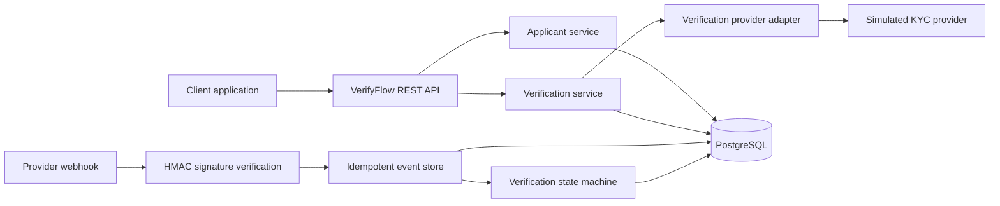
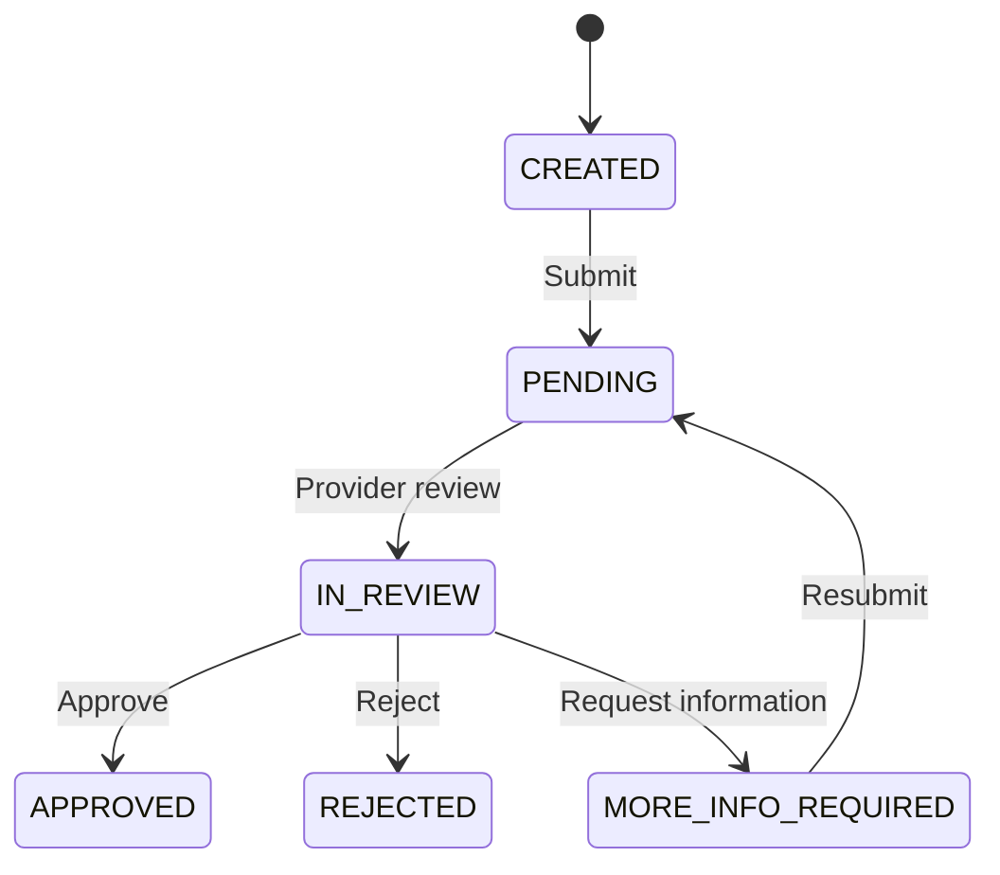

# VerifyFlow KYC

[](https://github.com/Andorta/verifyflow-kyc/actions/workflows/ci.yml)

A production-style KYC integration and verification workflow built with Java, Spring Boot, PostgreSQL, Flyway, and Docker.

VerifyFlow demonstrates how a backend service can create applicants, start identity-verification cases, receive signed provider webhooks, prevent duplicate processing, and expose current and historical verification statuses.

> This is a portfolio demonstration. It uses a simulated verification provider and does not perform real identity verification or store identity documents.

## Business problem

Companies integrating a KYC provider need more than a single API call. They must also manage:

- Applicant records and external customer references
- Verification sessions and status transitions
- Authenticated provider webhooks
- Duplicate webhook deliveries
- Database consistency and auditability
- Clear API errors for client applications

VerifyFlow implements these integration concerns behind a REST API.

## Features

- Create and retrieve applicants
- Start verification cases through a provider abstraction
- Track verification status transitions
- Receive HMAC-SHA256 signed webhooks
- Reject invalid webhook signatures
- Process webhook events transactionally
- Prevent duplicate processing with database-backed idempotency
- Store webhook metadata and payload hashes
- Retrieve individual verification cases
- Retrieve applicant verification history newest-first
- Return structured API error responses
- Manage schema changes with versioned Flyway migrations
- Validate persistence against PostgreSQL
- Protect concurrent updates with optimistic locking

## Technology

- Java 21
- Spring Boot 4
- Spring MVC
- Spring Data JPA
- PostgreSQL 17
- Flyway
- Docker Compose
- Maven Wrapper
- JUnit 5
- Mockito
- AssertJ
- MockMvc
- OpenAPI 3
- Swagger UI

## Architecture



The provider interface separates VerifyFlow’s domain logic from a specific vendor. A real provider such as Stripe Identity, Sumsub, Veriff, or Onfido could be introduced through another adapter.

## Verification lifecycle



Invalid transitions are rejected by the domain model.

## API endpoints

| Method | Endpoint | Purpose |
|---|---|---|
| `POST` | `/api/v1/applicants` | Create an applicant |
| `GET` | `/api/v1/applicants/{id}` | Retrieve an applicant |
| `POST` | `/api/v1/applicants/{id}/verification-cases` | Start verification |
| `GET` | `/api/v1/verification-cases/{id}` | Retrieve a verification case |
| `GET` | `/api/v1/applicants/{id}/verification-cases` | Retrieve verification history |
| `POST` | `/api/v1/webhooks/verification/{provider}` | Receive a provider webhook |
| `GET` | `/actuator/health` | Check application health |

## Interactive API documentation

When the application is running, the interactive Swagger interface is available at:

```text
http://127.0.0.1:8080/swagger-ui.html

## Running locally

### Requirements

To run the complete containerized stack:

- Docker Desktop

To run the application directly from source:

- Java 21
- Docker Desktop

Maven does not need to be installed because the repository includes the Maven Wrapper.

### Option 1: Run the complete containerized stack

Build and start VerifyFlow and PostgreSQL:

```bash
docker compose up --build -d
docker compose ps
```

The API will be available at:

```text
http://127.0.0.1:8080
```

Check its health:

```bash
curl http://127.0.0.1:8080/actuator/health
```

Stop the stack:

```bash
docker compose down
```

The PostgreSQL data remains in its named Docker volume.

### Option 2: Run the application from source

Start only PostgreSQL:

```bash
docker compose up -d postgres
```

Run Spring Boot:

```bash
./mvnw spring-boot:run
```

## Example workflow

### 1. Create an applicant

```bash
curl -i \
  -X POST \
  http://127.0.0.1:8080/api/v1/applicants \
  -H 'Content-Type: application/json' \
  --data-raw '{
    "externalReference": "portfolio-customer-001",
    "email": "customer@example.com",
    "countryCode": "GB"
  }'
```

The API returns HTTP `201` and the new applicant UUID.

### 2. Start verification

Replace the value below with the applicant UUID:

```bash
APPLICANT_ID='replace-with-applicant-uuid'

curl -i \
  -X POST \
  "http://127.0.0.1:8080/api/v1/applicants/$APPLICANT_ID/verification-cases"
```

The response contains a case ID, provider reference, verification URL, and `PENDING` status.

### 3. Send a signed provider webhook

Replace the provider reference with the value returned when verification started:

```bash
PROVIDER_REFERENCE='replace-with-provider-reference'

PAYLOAD="{\"eventId\":\"event-demo-001\",\"providerReference\":\"$PROVIDER_REFERENCE\",\"status\":\"APPROVED\"}"

SIGNATURE=$(printf '%s' "$PAYLOAD" |
  openssl dgst -sha256 \
  -hmac 'local-dev-webhook-secret' |
  awk '{print $NF}')

curl -i \
  -X POST \
  http://127.0.0.1:8080/api/v1/webhooks/verification/mock \
  -H 'Content-Type: application/json' \
  -H "X-Webhook-Signature: sha256=$SIGNATURE" \
  --data-raw "$PAYLOAD"
```

The first delivery returns:

```json
{
  "status": "PROCESSED"
}
```

Sending the identical event again returns:

```json
{
  "status": "DUPLICATE"
}
```

### 4. Retrieve verification history

```bash
curl \
  "http://127.0.0.1:8080/api/v1/applicants/$APPLICANT_ID/verification-cases"
```

## Security and reliability decisions

### Signed webhooks

Webhook signatures use HMAC-SHA256 and are compared using a constant-time comparison. The signature is checked against the exact raw request body before JSON parsing.

The development secret has a local default. A deployed environment should supply it through:

```bash
WEBHOOK_SECRET='replace-with-a-secure-secret'
```

### Idempotent processing

Providers retry webhook deliveries when responses are delayed or lost. VerifyFlow prevents duplicate processing with a unique database constraint on provider and event ID.

Registration uses an atomic PostgreSQL insert with `ON CONFLICT DO NOTHING`, avoiding a check-then-insert race condition.

### Transaction boundaries

Webhook registration, verification-state changes, and processed-event updates execute inside one transaction. Failures roll back the complete operation.

### Data minimisation

The webhook event table stores a SHA-256 payload hash and event metadata rather than retaining the complete raw provider payload.

### Database integrity

The database enforces foreign keys, unique constraints, status checks, timestamps, and optimistic-lock versions. Flyway owns all schema changes.

## Testing

Run the complete suite with PostgreSQL running:

```bash
./mvnw clean test
```

The project currently includes 46 tests covering:

- Domain-state transitions
- Applicant and verification services
- REST controller behavior
- Validation and structured errors
- JPA persistence against PostgreSQL
- Webhook signature verification
- Atomic duplicate-event registration
- Transactional webhook processing
- Verification status and history retrieval

## Production extensions

For a production deployment, the next considerations would include:

- Authentication and role-based access control
- A real KYC provider adapter
- Secret management and key rotation
- Webhook timestamp validation and replay windows
- API rate limiting
- Database-backed audit reporting
- Metrics, tracing, and alerting
- PII retention and deletion policies
- Deployment and infrastructure configuration

## What this project demonstrates

This project demonstrates the ability to:

- Design a REST API around a business workflow
- Integrate an external verification provider
- Implement secure and idempotent webhooks
- Model controlled domain-state transitions
- Design and migrate a relational database
- Build layered, testable Spring Boot services
- Handle failure cases expected in production integrations